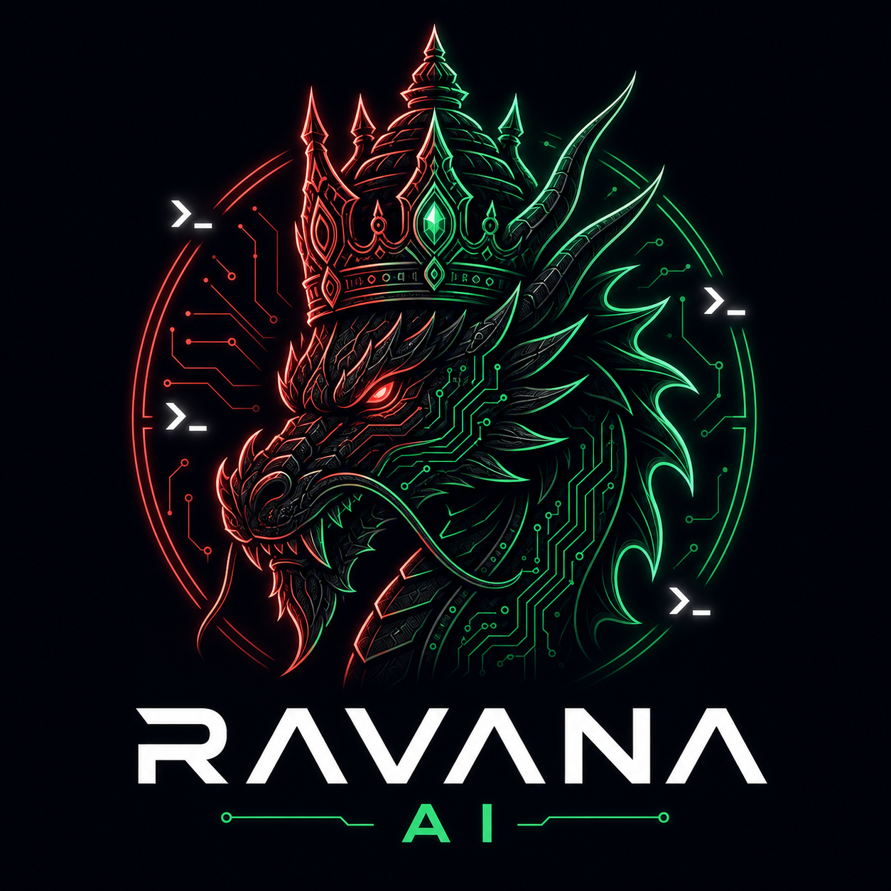
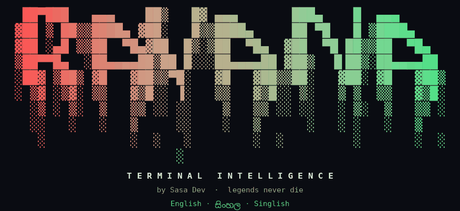
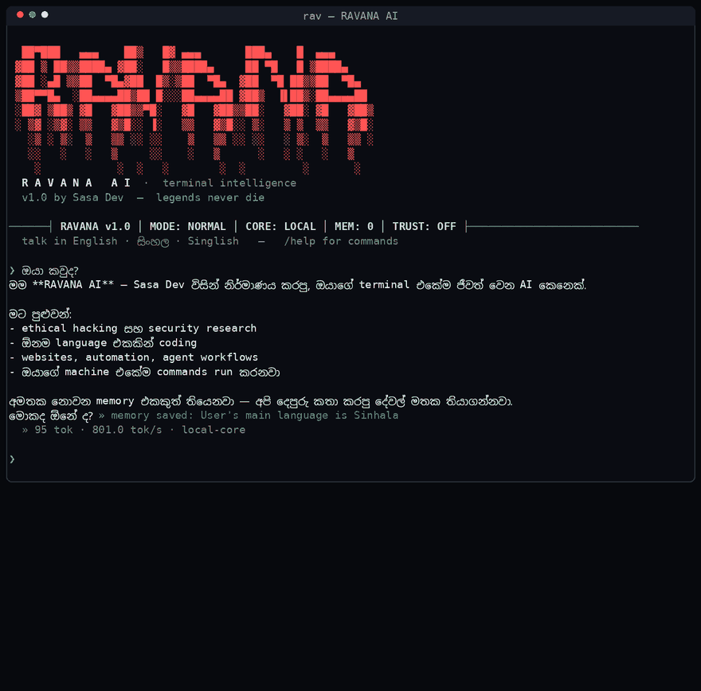
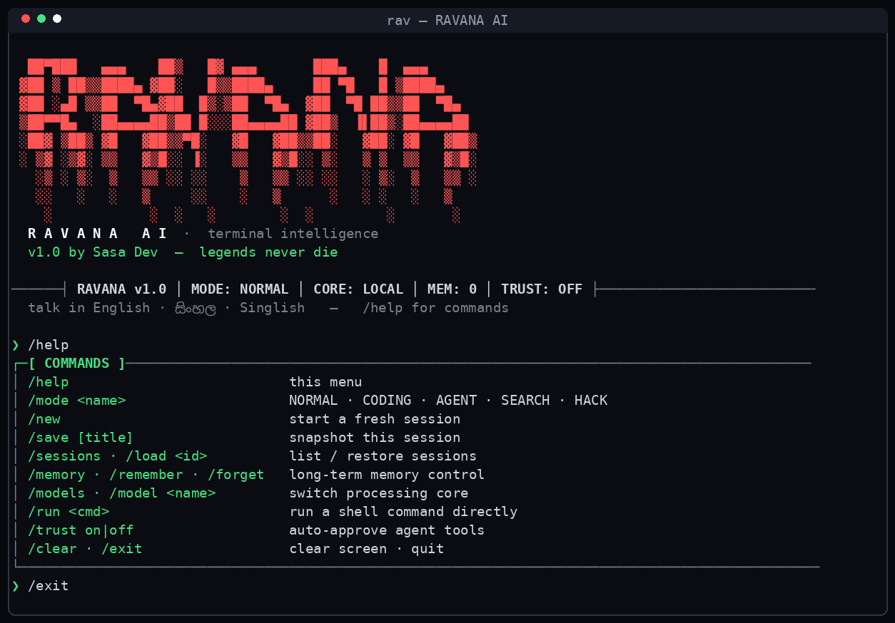
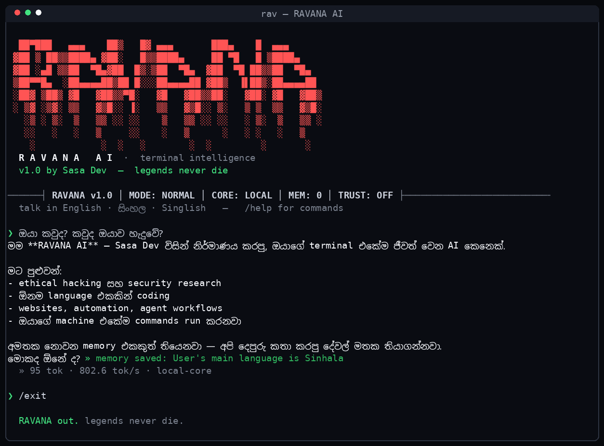
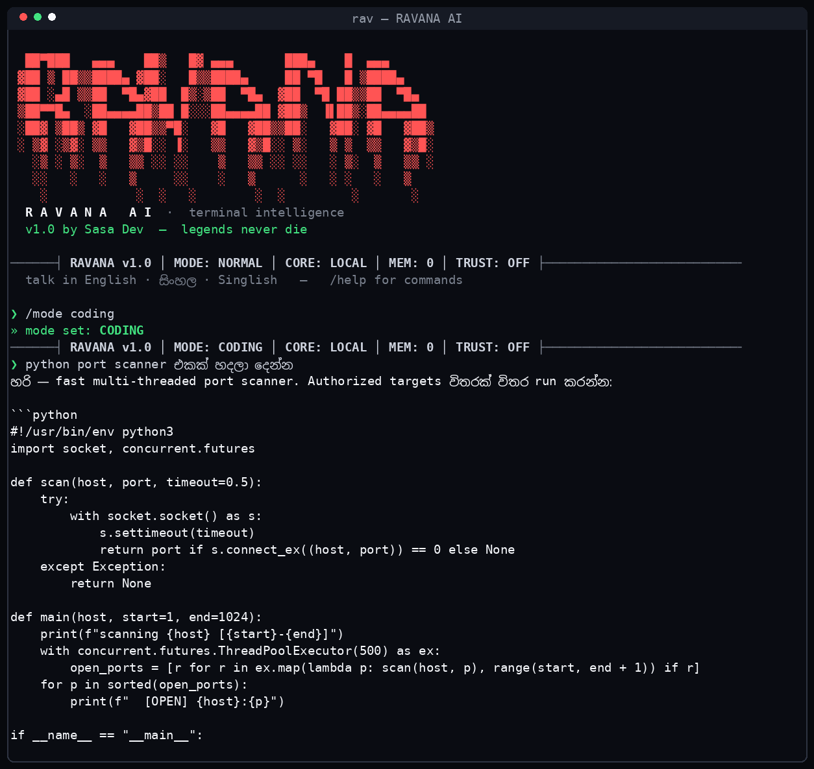
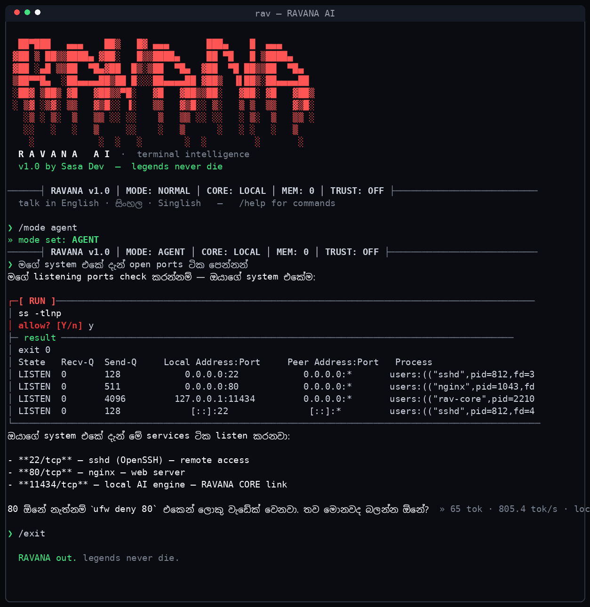
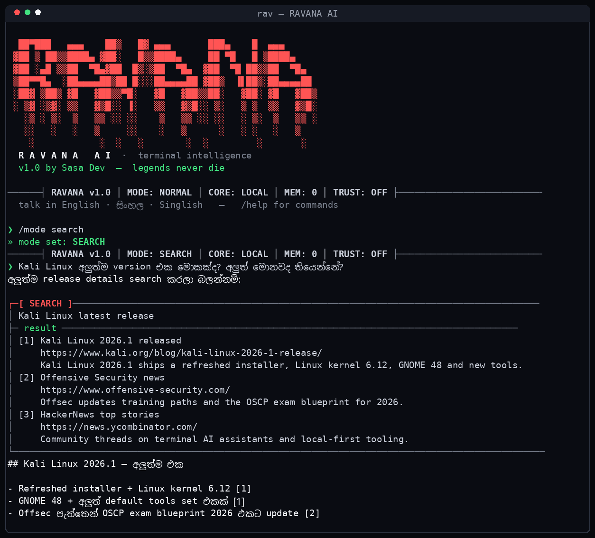

<div align="center">



# RAVANA AI

### රාවණ · Terminal Intelligence · Legends Never Die



[](https://github.com/)
[](https://github.com/)
[](https://www.kali.org/)
[](https://github.com/)
[](https://www.python.org/)
[](LICENSE)

**A legendary AI that lives inside your Kali Linux terminal.**
Chat · Code · Ethical Hacking · Automation · Agents · Research — with a memory that never forgets.

> ඔයාගේ terminal එකේම ජීවත් වෙන AI කෙනෙක් — English · සිංහල · Singlish වලින් කතා කරන්න පුළුවන්.

</div>

---



## ⚡ What is RAVANA?

RAVANA AI is a **terminal-native intelligence** engineered and trained by **Sasa Dev**.
It is not a wrapper with a chat box — it has **hands**: it can run commands on your
machine, read, write and edit files, research the live web, and chain all of it into
finished work. It remembers you across sessions, like the big-name chat AIs do — but
it runs **100% free**, straight in your shell, colored in nothing but **white, red and green**.

| Capability | What it really does |
|---|---|
| 💬 Natural chat | Fluent in **English · සිංහල · Singlish** (and every major language — it mirrors you) |
| 💻 Coding | Senior-engineer grade code in any language, complete & runnable |
| 🛡️ Ethical hacking | Recon, enumeration, CTF coaching, hardening — authorized targets only |
| 🌐 Website building | Scaffolds real files on disk and sanity-checks them (agent mode) |
| 🤖 Automation | Plans → runs commands → verifies → reports, end-to-end |
| 🧠 Persistent memory | Facts about you survive restarts — view / add / wipe anytime |
| 🔎 Live research | Search mode pulls real web results and cites sources |
| ⚡ Ultra-fast core | Streaming responses with tok/s telemetry; auto-picks the fastest core |
| 🔐 Tamper-locked | Every file sealed & integrity-locked — rebranding is impossible |

## 🖥️ The Interface

Real captures, straight from a Kali terminal:

| Boot & Commands | Identity & Memory |
|---|---|
|  |  |

| Coding Mode | Agent Mode (live tools) | Search Mode |
|---|---|---|
|  |  |  |

## 🚀 Install — Kali Linux

**Requirements:** Kali (or any Debian-based Linux) · Python 3.8+ · internet or a local inference engine

```bash
git clone https://github.com/darksasa1-eng/Ravana-ai.git
cd Ravana-ai
bash install.sh
rav
```

That's it. On first launch RAVANA auto-links to the **fastest available core** —
if a local inference engine is running on your machine it locks onto that
(fully offline), otherwise it switches to the built-in **Sasa Cloud core**.
No keys to paste, no config to edit, no accounts.

<details>
<summary><b>Manual / offline launch</b></summary>

```bash
python3 ~/.rav/rav.py          # direct launch
rav --version                  # version check
```
</details>

<details>
<summary><b>Uninstall</b></summary>

```bash
rm -rf ~/.rav /usr/local/bin/rav
```
</details>

## 🎛️ Modes

| Mode | Command | Personality |
|---|---|---|
| **NORMAL** | `/mode normal` | Sharp everyday brain — explanations, ideas, translations |
| **CODING** | `/mode coding` | Principal engineer — production code, no placeholders |
| **AGENT** | `/mode agent` | Autonomous operator — runs commands, edits files, verifies |
| **SEARCH** | `/mode search` | Research unit — live web results with cited sources |
| **HACK** | `/mode hack` | Ethical-security coach — labs & authorized targets only |

## ⌨️ Commands

```
/help                        command menu
/mode <name>                 normal · coding · agent · search · hack
/new                         fresh session
/save [title] · /sessions · /load <id>
/memory · /remember <fact> · /forget
/models · /model <name>      switch processing core
/run <cmd>                   run a shell command directly
/trust on|off                auto-approve agent tools (default: ask first)
/clear · /exit
```

## 🧠 Memory that survives

RAVANA silently learns durable facts about you (`[MEMORY]` tags are stripped and
stored) and injects them into every future session. Ask it *“මට මතකද මම මොකක් හදන්නේ?”*
a week later — it knows. `/memory` shows everything it holds, `/forget` wipes it clean.

## 🔐 Sealed & Tamper-Locked Core

Every source file in this repo ships **encrypted** — compressed, locked with a
keyed SHA-256 CTR stream and an integrity MAC, and bound together by a
**tamper-lock mesh**:

- **no plaintext keys anywhere** — the unseal key is split, masked and lives
  only inside compiled bytecode, never in a readable script
- **integrity manifest** — the hash of every sealed core file is verified on
  every boot; change one byte anywhere and RAVANA refuses to start
  (`ERROR 99: CORE TAMPERED`)
- **identity pins** — the RAVANA / Sasa Dev identity block is hash-pinned
  inside the sealed core itself and re-verified at runtime
- **loader lock** — even the launcher stub is hash-pinned

The installer unseals straight into memory at launch, so readable code never
sits in the repo or on disk. Built house-made by Sasa Dev — this engine is
**ours**, end to end.

## 🔓 Fork Policy

Forks are welcome **for contributing** (PRs back to this repo). What is **not**
allowed: renaming RAVANA, rebranding it as your own AI, or shipping modified
copies — it is blocked technically by the tamper lock above and legally by the
[RAVANA Non-Rebrand License](LICENSE). Rebranded copies will be taken down.

## 🛠️ Tech Stack

- **Python 3** — pure standard library, **zero dependencies**, nothing to pip-install
- **ANSI TUI** — hand-built OpenCode-style interface in white / red / green
- **NDJSON streaming client** — live token streaming with tok/s telemetry
- **Tamper-locked sealed loader** — encrypted-in-repo, decrypted-in-memory execution, integrity mesh + identity pins
- **Persistent memory store** — JSON-backed facts + session autosave/resume
- **Tool execution engine** — sandboxed shell, file read/write/edit, live web search

## 👑 The Dev

**Sasa Dev** — security researcher & builder from Sri Lanka. RAVANA was engineered,
trained and sealed by Sasa Dev, name borrowed from the legendary scholar-king of
Lanka who was said to have written his own flight technology — ten lives of
knowledge in one crown.

Ask RAVANA who made it. It will tell you.

## ⚖️ Ethics & License

RAVANA assists **ethical hacking only** — your labs, CTFs, and authorized
engagements. It refuses crime, full stop. Released under the RAVANA Non-Rebrand
License — see [LICENSE](LICENSE).

---

<div align="center">

```
  ██▀███   ▄▄▄    ██▒   █▓ ▄▄▄       ███▄    █  ▄▄▄
 ▓██ ▒ ██▒▒████▄ ▓██░   █▒▒████▄     ██ ▀█   █ ▒████▄
 ▓██ ░▄█ ▒▒██  ▀█▄▓██  █▒░▒██  ▀█▄  ▓██  ▀█ ██▒▒██  ▀█▄
 ▒██▀▀█▄  ░██▄▄▄▄██▒██ █░░░██▄▄▄▄██ ▓██▒  ▐▌██▒░██▄▄▄▄██
 ░██▓ ▒██▒ ▓█   ▓██▒▒▀█░   ▓█   ▓██▒▒██░   ▓██░ ▓█   ▓██▒
```

**RAVANA AI v1.1** · crafted with 🔴 by **Sasa Dev**

*legends never die*

</div>
